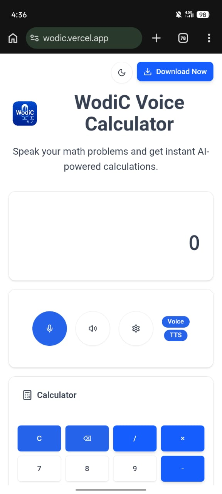
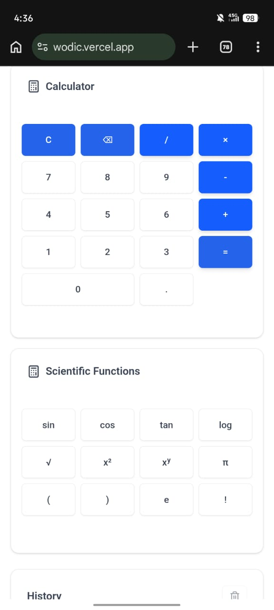
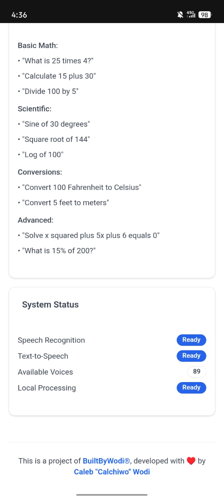
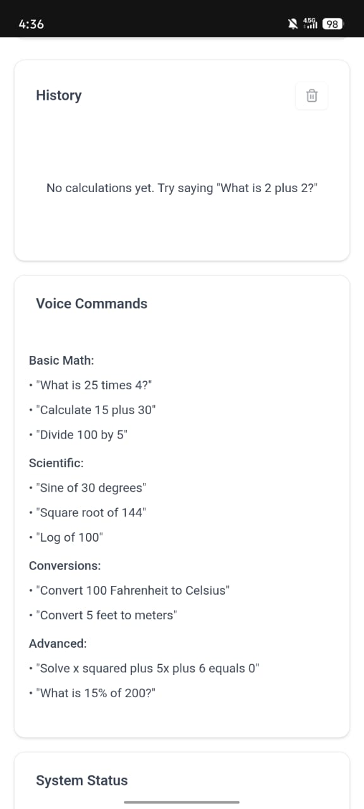

# WodiC, The Voice Calculator


**WodiC** is an AI voice scientific calculator I built entirely on my phone using mobile IDEs like Termux and Acode.

I've always wanted a calculator that I can speak my math problems to, and it solves them instantly, even offline.

That led me to write the initial version of WodiC voice calculator in Java and XML using AIDE in July 2025 I shared it with a few of my friends, I got a few feedbacks from them and that shaped the foundation of what would become WodiC the voice calculator

<p float="left">
  
   
  
  
</p>

## Overview

WodiC voice calculator app captures spoken math input using the Web Speech API, converts speech to text in real time, and parses the text into a structured mathematical expression processed by a local evaluation engine that handles arithmetic, scientific functions, and constants without relying on any backend service.

All computation happens locally on the device, which enables offline support once the app is installed and ensures low latency, privacy, and reliability throughout the entire interaction.

After evaluation, WodiC renders the formatted equation and result instantly in the interface and converts the result back to speech using native browser speech synthesis, allowing hands free interaction from input to output on both mobile and desktop.

WodiC runs on Next.js using the App Router and ships as a Progressive Web App, with assets, logic, and UI cached locally through a service worker to enable fast loading and consistent offline behavior.

## Features

- Voice input
- Instant results
- Scientific mode
- Dark mode
- Natural voice replies
- Lightweight performance
- Works offline
- Installable as a PWA

## Tech stack I used

- Next.js, React
- TypeScript compiled to JavaScript
- Tailwind CSS, PostCSS
- Web Speech API and Speech Synthesis API
- Service Workers for offline support
- pnpm
- Vercel deployment

## Usage

1. Visit [https://wodic.vercel.app](https://wodic.vercel.app)
2. Allow microphone access
3. Speak a command
4. WodiC displays the equation and speaks the result
5. Tap the install option in your browser to add the PWA

## Example Commands

| You Say | WodiC Replies |
|--------|----------------|
| What is fifty plus forty | The answer is ninety |
| Square root of eighty one | The answer is nine |
| Cosine of thirty degrees | The answer is zero point eight six six |
| Ten factorial | The answer is three million six hundred twenty eight thousand eight hundred |

## Roadmap

- Voice input with instant results, complete
- Scientific mode, complete
- Full offline support, complete
- PWA installation, complete
- History log, complete
- AI explanation mode
- Improved UI and UX
- Better error handling
- Scientific tools
- Graph plotting
- Matrix solving
- Factorial
- More input formats
- Expanded documentation

## How to Run

Follow these steps to run this Next.js project on your phone or computer.

1. **Clone the repository**

```bash
git clone https://github.com/calchiwo/WodiC.git
```

2. **Open the project folder**

```bash
cd WodiC
```

3. **Install dependencies**

```bash
npm install
```

4. **Run the development server**

```bash
npm run dev
```

5. **Open the app**

Visit this URL in your browser.

```
http://localhost:3000
```

## License

This project is **open source** under the [MIT License](LICENSE)

## Contributing

Contributions are welcome!

## Author

- **Caleb Wodi**
- [Twitter](https://x.com/calchiwo)
- [LinkedIn](https://www.linkedin.com/in/calchiwo)
